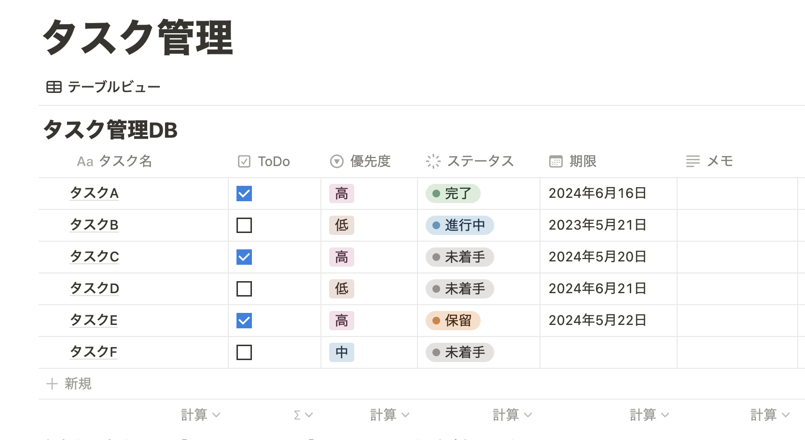

# notion-task-app
 - メニューバーからNotionへの連携をするツール
 - 10分に1度自動でタスク更新します。
   - [notion_task_management.10m.py](src/apps/notion_task_management.10m.py)の10mを変更することで、更新頻度を変更することが可能です。
   - 参考 : [ファイル名の命名規則](https://github.com/swiftbar/SwiftBar)

# 起動方法
1. swiftbarを起動
2. （最初のみ）[Open plugin Folder...]からnotion-task-app/src/appsディレクトリを選択

# 設定

## 1. Notion
 - データベースを作成する。
   - 参照：[データベース作成方法](https://www.notion.so/ja-jp/help/create-a-database)
 - データベースのカラムを設定する（下表はデフォルト設定値 / 順不同）。
    | プロパティの型 | プロパティ名 |
    | ---- | ---- |
    | title | タスク名 |
    | date | 期限 |
    | status | ステータス |  
    | checkbox | ToDo |
    | select | 優先度 |
    | rich_text | メモ |

    ※カラムを変更する際は、[Notion APIリファレンスのtypeを参照](https://developers.notion.com/reference/property-object)し、[column_setting.json](column_setting.json)を修正する。

    

 - インテグレーションを作成しAPIトークンを取得する
   - 参照：[作成方法](https://www.notion.so/ja-jp/help/create-integrations-with-the-notion-api)
 - NotionDBのIDを取得する
   1. 作成したNotionDBを開く
   2. 開いたURLの32桁のDatabase_idを取得する
        
https://www.notion.so/{Database_id(32桁)}?v={view_id}

    - 例）
      - 
 URL：https://www.notion.so/3a4b5c6d7e8f9a0b1c2d3e4f5a6b7c8d?v=8e4b9797aa894041b8de89d4cf61ced4

      - database_id :
        -  3a4b5c6d7e8f9a0b1c2d3e4f5a6b7c8d
      - view_id     : 
        - 8e4b9797aa894041b8de89d4cf61ced4

 - NotionDBとインテグレーションをコネクトする
   - 参照：[APIを使用した接続の追加と管理
](https://www.notion.so/ja-jp/help/add-and-manage-connections-with-the-api)

## ２. 環境構築
